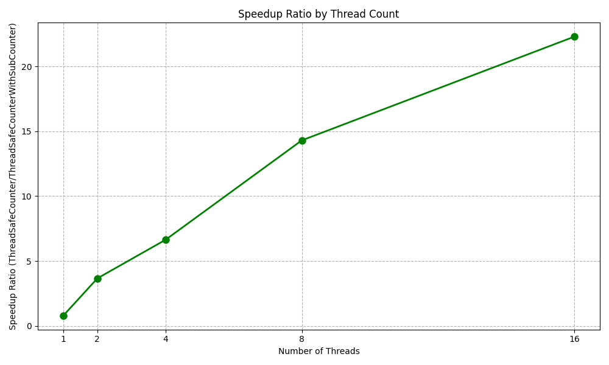
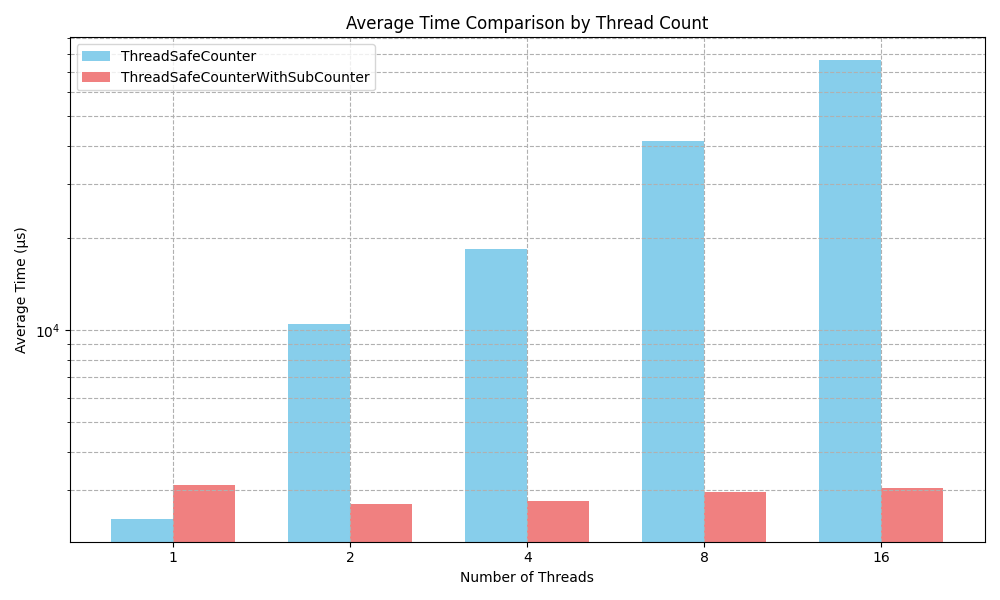

# ThreadSafeCounter

This repository implmented 2 versions of thread-safe counter
- ThreadSafeCounter
- ThreadSafeCounterWithSubCounter

## Unique Public Methods of `ThreadSafeCounterWithSubCounter`
- `register_counter()`: Registers a new sub-counter.

## Common Public Methods
`ThreadSafeCounter` and `ThreadSafeCounterWithSubCounter` both implement the following public methods:
- `increment()`: Increments the counter by 1.
  - for `ThreadSafeCounterWithSubCounter`, the thread must register a sub-counter before calling this method.
- `get_count()`: Returns the total current count.

## Benchmark
Run the benchmark using the following command:
```bash
g++ --std=c++20 --pedantic counter-benchmark.cpp -o benchmark.out
./benchmark.out
```

## Benchmark Output
When the number of thread is higher, the speedup of `ThreadSafeCounterWithSubCounter` is more significant than `ThreadSafeCounter`.




```
============================================
Counter Performance Benchmark
Operations per thread: 100000
Iterations per test: 5
============================================

Testing with 1 threads:
--------------------------------------------
ThreadSafeCounter:
  Min time: 1924 µs
  Max time: 2597 µs
  Avg time: 2415 µs
  Median:   2523 µs

ThreadSafeCounterWithSubCounter:
  Min time: 2754 µs
  Max time: 3550 µs
  Avg time: 3113 µs
  Median:   3160 µs

Performance comparison:
  Speedup ratio (ThreadSafeCounter/ThreadSafeCounterWithSubCounter): 0.80x
  The ThreadSafeCounter implementation is 25.25% faster

============================================

Testing with 2 threads:
--------------------------------------------
ThreadSafeCounter:
  Min time: 9031 µs
  Max time: 12694 µs
  Avg time: 10481 µs
  Median:   9876 µs

ThreadSafeCounterWithSubCounter:
  Min time: 2644 µs
  Max time: 2777 µs
  Avg time: 2699 µs
  Median:   2690 µs

Performance comparison:
  Speedup ratio (ThreadSafeCounter/ThreadSafeCounterWithSubCounter): 3.67x
  The ThreadSafeCounterWithSubCounter implementation is 267.14% faster

============================================

Testing with 4 threads:
--------------------------------------------
ThreadSafeCounter:
  Min time: 17724 µs
  Max time: 19491 µs
  Avg time: 18384 µs
  Median:   18360 µs

ThreadSafeCounterWithSubCounter:
  Min time: 2753 µs
  Max time: 2779 µs
  Avg time: 2765 µs
  Median:   2763 µs

Performance comparison:
  Speedup ratio (ThreadSafeCounter/ThreadSafeCounterWithSubCounter): 6.64x
  The ThreadSafeCounterWithSubCounter implementation is 564.50% faster

============================================

Testing with 8 threads:
--------------------------------------------
ThreadSafeCounter:
  Min time: 39950 µs
  Max time: 43707 µs
  Avg time: 41552 µs
  Median:   41416 µs

ThreadSafeCounterWithSubCounter:
  Min time: 2800 µs
  Max time: 3257 µs
  Avg time: 2954 µs
  Median:   2897 µs

Performance comparison:
  Speedup ratio (ThreadSafeCounter/ThreadSafeCounterWithSubCounter): 14.30x
  The ThreadSafeCounterWithSubCounter implementation is 1329.62% faster

============================================

Testing with 16 threads:
--------------------------------------------
ThreadSafeCounter:
  Min time: 64594 µs
  Max time: 101465 µs
  Avg time: 76240 µs
  Median:   65821 µs

ThreadSafeCounterWithSubCounter:
  Min time: 2840 µs
  Max time: 3513 µs
  Avg time: 3047 µs
  Median:   2953 µs

Performance comparison:
  Speedup ratio (ThreadSafeCounter/ThreadSafeCounterWithSubCounter): 22.29x
  The ThreadSafeCounterWithSubCounter implementation is 2128.95% faster

============================================

```